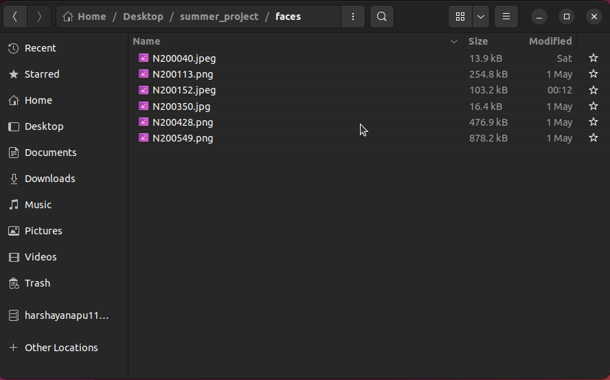

# Face Recognition Attendance System with ESP32-CAM

This project is an advanced, real-time attendance system that uses an ESP32-CAM for video capture, performs robust face recognition, and ensures user liveness before marking attendance in an Excel spreadsheet.

It represents a significant evolution from an earlier [OpenCV-based Facial Recognition with Anti-Spoofing project](https://github.com/Harsha-2104/OpenCV_based_Facial_recognition_with_Anti_spoofing.git).

### Key Advancements from the Original Project
- **Hardware Integration**: Upgraded from a standard PC webcam to a network-based **ESP32-CAM**, transforming the system into a flexible IoT solution.
- **Enhanced Liveness Detection**: The anti-spoofing mechanism has been completely redesigned into a more secure, multi-step verification process (Blink -> Lip Movement -> Head Turn).
- **Improved Blink Detection**: Implemented a precise three-frame sequence check (`open-close-open` or `close-open-close`) for blinking, making it faster and more reliable than the previous duration-based method.
- **Better User Experience**: Added clear, real-time on-screen feedback to guide users through the necessary actions for liveness verification.

---
## Features

- **Real-Time Face Recognition**: Identifies known individuals from a live video stream.
- **Multi-Step Liveness Verification**: Implements a mandatory sequence of checks to prevent spoofing from photos or videos.
    1.  **Blink Detection**: Recognizes a natural blink within a strict three-frame window.
    2.  **Lip Movement**: Detects vertical movement of the lips.
    3.  **Head Turn**: Detects a side-to-side head turn.
- **Automated Attendance Logging**: Automatically records the names and timestamps of verified individuals into a session-specific Excel sheet.
- **ESP32-CAM Integration**: Designed to work directly with the live stream from an ESP32-CAM on your local network.

---

## Hardware and Software Requirements

### Hardware
- ESP32-CAM module
- A computer to run the main Python script

### Software
- Python 3.8+
- The `shape_predictor_68_face_landmarks.dat` file for dlib.
  
### Python Libraries
- `opencv-python`
- `dlib`
- `face_recognition`
- `numpy`
- `scipy`
- `openpyxl`

---

## Setup and Installation

1.  **Clone the Repository**:
    ```bash
    git clone [https://github.com/Harsha-2104/Face_recognition_system_using_ESP_32_CAM.git](https://github.com/Harsha-2104/Face_recognition_system_using_ESP_32_CAM.git)
    cd Face_recognition_system_using_ESP_32_CAM
    ```

2.  **Install Dependencies**:
    Install all the required libraries using pip:
    ```bash
    pip install opencv-python dlib face-recognition numpy scipy openpyxl
    ```

3.  **Download the Landmarks Predictor**:
    Download the `shape_predictor_68_face_landmarks.dat` file.  You can directly download it from [here](https://www.kaggle.com/datasets/sergiovirahonda/shape-predictor-68-face-landmarksdat). Place this file in the same directory as the Python script.

4.  **Create the Known Faces Directory**:
    - Create a folder named `faces` in the project directory.
    - Inside the `faces` folder, add images of the individuals you want the system to recognize.
    - **Important**: Name each image file with the person's name (e.g., `Harsha_yanapu.jpg`, `N200428.png`). The filename will be used as the person's ID in the attendance sheet.
      
    

5.  **Configure the ESP32-CAM**:

    - Set up your ESP32-CAM to stream video on your local network. Use the Webserver_attendance file in this repository.
    - Run the Webserver_attendance.ino file in the arduino ide using your ESP-32 CAM module(Ai-thinker model is preferred).
      
      
    - Find the IP address of your ESP32-CAM.
    - Open the main Python script and update the `ESP32_CAM_URL` variable with your camera's streaming URL.
      ```python
      ESP32_CAM_URL = "http://YOUR_ESP32_IP_ADDRESS:81/stream"
      ```

---

## How to Use

1.  **Run the Script**:
    Execute the main Python script from your terminal:
    ```bash
    python "face recognition code.py"
    ```

2.  **Create an Attendance Sheet**:
    When the script starts, it will prompt you in the terminal to provide a name for the day's attendance session.
    ```
    Please provide a name for today's attendance sheet (e.g., "Lab_Session_1"):
    ```
    An Excel file named `attendance_excel.xlsx` will be created with a new sheet named in the format `YYYY-MM-DD_YourSessionName`.

3.  **Perform Liveness Checks**:
    - A window will appear showing the video feed from the ESP32-CAM.
    - Position your face in the frame. The system will draw a red box around your face and prompt you for an action.
    - Follow the on-screen instructions in this order:
        1.  **Blink to Start**: Perform a clear blink.
        2.  **Move lips & Turn head**: After a successful blink, you have 5 seconds to move your lips and turn your head.
    - Once all checks are passed, the box around your face will turn green.

4.  **Mark Attendance**:
    - If the system recognizes you as a known person after the liveness check, your name and the current time will be recorded in the Excel sheet.
    - The system will not mark attendance for the same person more than once in the same session.

5.  **Quit the Program**:
    Press the `q` key with the video window in focus to stop the script. The Excel file will be saved automatically.

---

##  Live Demo

Click [Here](https://www.linkedin.com/posts/harsha-yanapu-392a11253_esp32-facerecognition-embeddedsystems-activity-7358090854097440768-UiY1) to see my Linked In post for live demo.
